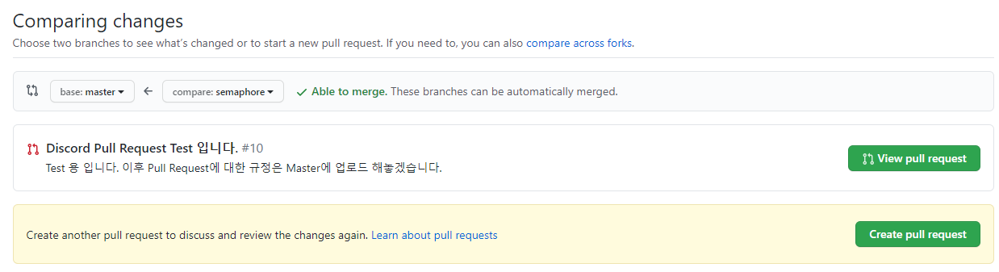
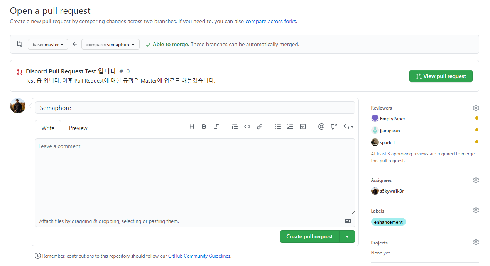
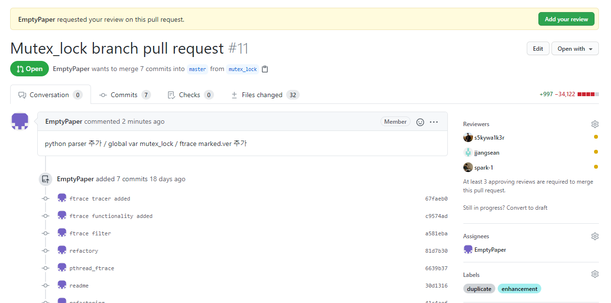
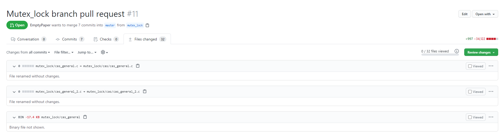
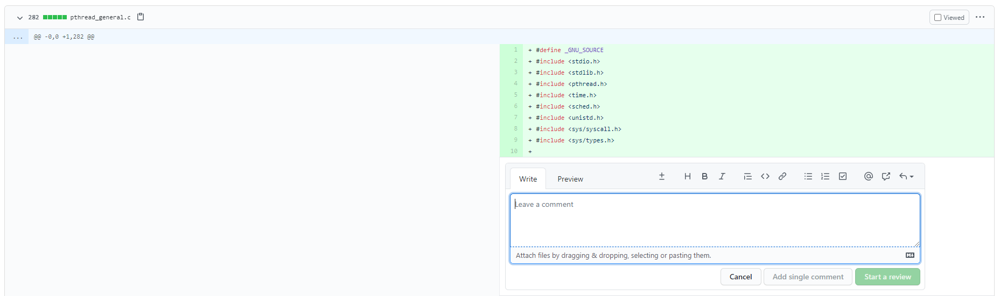
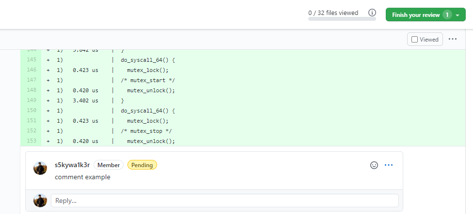
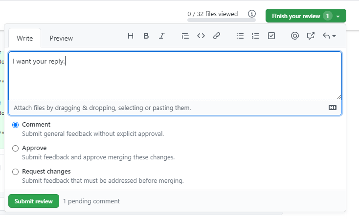
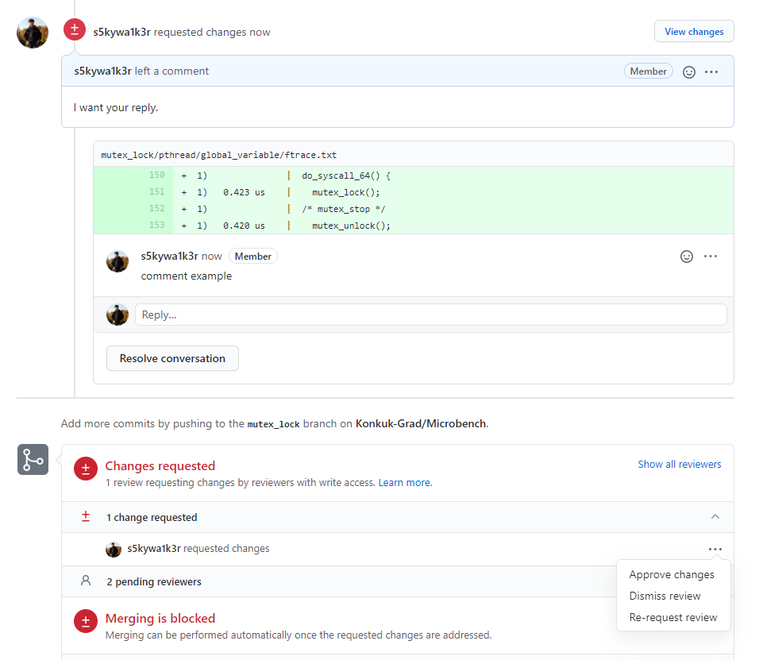
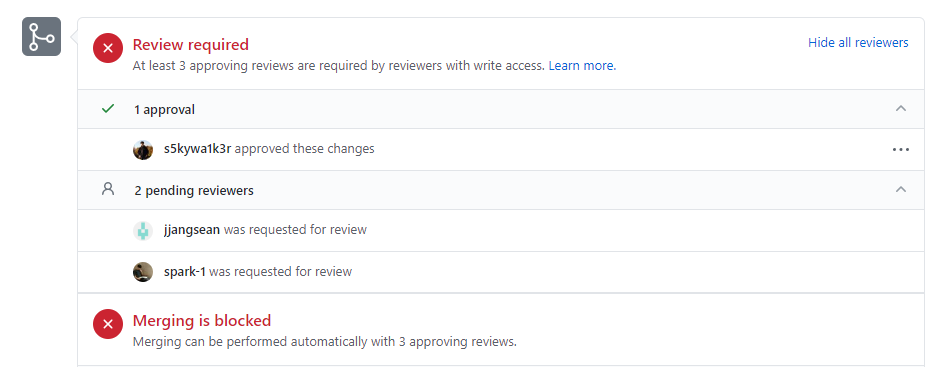

# Microbench

실시간 시스템 콜 분야별 측정

## 측정 분야

- Signal: 김상재

- Mutex/Semaphore: 이종빈, 장서연
 
- IPC: 박성준
  application code compile <br>
  ``` $gcc -o <file_name> <file_name>.c -lrt ``` <br>
    (Signal을 제외한 나머지 환경은 Single Producer Single Consumer 환경에서 측정 진행)

## 측정 환경

- OS: Ubuntu 20.04 LTS
- Kernel Version: 5.4.0-37-generic
- CPU Core/Threads: 16-Cores, 16-Threads

## Git 사용 규칙

- ~~각자 알아서 브랜치 만들어서 작업하고 master로 push ㄱ~~
- Master branch 사용을 위해 다음과 같은 규칙을 신설함.

  - ### 간략한 설명

  1. pull request를 통해 master branch에 특정 branch의 코드를 올리려고 한다는 요청을 해야함.
  2. 각 팀원들은 되도록이면 신속하게 확인해주길 권장.
  3. 모든 Reviewer가 approve 할 시 본인이 추가적인 comment 확인 후 merge 실시

  - ### 자세한 설명

    - Master branch에 임의로 push를 불가능하게 만들었고 ***create pull request***를 통해서 각 개발자들에게 요청을 하고 승인을 받아야 master에 업로드 하도록 변경
    
    #### 1. 어떤 branch에 pull request를 생성할 것인지?

    
    - \****주의*** \* compare에서 base branch로 pull request를 요청하는 것임.
      - ex) semaphore branch의 코드들을 master에 올리고 싶으면 base: master, compare: semaphore로 설정하면 됨.

    #### 2. pull request 생성 시 필수 요소

    

    1. Pull request의 제목을 적고 Leave a comment에는 pull request에 대한 내용을 각 팀원이 이해할 수 있도록 작성.
    2. 우측에 Reviewer는 **본인을 제외한 모든 팀원**을 추가
    3. assignee는 pull request를 생성한 **본인**을 추가
    4. label은 본인이 생각하였을 때 가장 적절한 label 추가
    5. Create pull request 클릭

    #### 3. pull request 생성 완료

    
    - Reviewer로 걸린 사람들은 각자 Review를 해주어야 함. Reviewer는 파일을 확인하고 추가적인 comment를 작성할 수도 있고 바로 ***Approve(승인)*** 해줄 수도 있음.

    #### 4. pull request를 통하여 수정되는 파일들 확인
    
    
    이 화면에서 우측에 초록색 ***Review changes***를 눌러서 바로 pull request를 ***Approve*** 해줄수도 있음.

    #### 5. 수정된 코드에 comment 남기기

    
    - 코드의 특정 라인 혹은 특정 라인들에 **comment**를 남길 수 있음.
    - 그리고 ***Add single comment*** 혹은 ***Start a review***를 누른다.
        - ***Add single comment***는 Assignee(Author)에게 따로 수정사항이나 질문을 하는 것이 아닌 그저 Reviewer의 간단한 댓글로 해석하면 된다. 특별하게 Author가 참고하지 않아도 되는 댓글이라고 생각하면 된다.
        - ***Start a review***는 해당 코드에 대한 질문 혹은 개선사항을 적고 Author에게 요청하여 Author가 인식하도록 하는게 주 목적이다. 이 기능을 사용하여 카카오톡에서가 아닌 github에서 코드에 대한 정보를 공유하는 것이 좋을 것 같다 판단하여 이 기능을 사용하고자 한다. 자세한 설명은 아래에 추가함.
    
    #### 6. Start a review를 하였을 경우 comment는 pending 상태가 된다.

    
    - 위에서 ***Start a review***를 하였을 경우 처음에는 **pending**된 상태로 작성한 본인에게만 보이는 상태가 된다. 이 때 우측 상단의 ***Finish your review***를 누른다.
    
    #### 7. Finish your review의 3가지 옵션

    
    - ***Finish your review***를 누를 경우 위와 같은 이미지가 나오게 된다.
    해당 이미지에서 ***Finish your review*** 우측의 숫자 **1**과 좌측 하단의 ***Submit review*** 우측의 **1 pending comment**는 위에서 여러 코드에서 적은 **본인의 pending 된 comment**에 해당하는 것을 Submit 하겠다는 것이다.

    1. Comment
        - 단순히 위에서 설명한 ***Add single comment***와 동일한 역할을 함. 추가적으로 적는건 pending된 comment들을 요약하는 정보로 따로 작성할 수 있음.
    2. Approve
        - 내가 이러한 comment들을 적었고 현재의 Review를 approve하겠다는 것을 의미함. 이 경우 **Pull request**가 ***Approve***됨과 동시에 **1. Comment**와 같은 역할을 하게 됨.
    3. Request changes
        - 이 경우는 Author가 해당 내용을 확인하고 변경을 하거나 답변을 하여 Reviewer와의 소통을 통해 해결이 되도록 하는 상태. 쉽게말하면 **질의 응답**
    
    #### 8. Request Changes를 한 reviewer가 해주어야 할 것.

    
    - ***Request change***를 하여 Author와 Reviewer간의 소통이 완료되었을 경우 **Reviewer**는 위와 같은 화면에서 ***Approve changes***를 눌러주어야 함.
    
    #### 9. 결론적으로 Reviewer들은 모두 Approve를 해야함.

    
    - **Reviewer**들은 최대한 빠른 시간 내에 pull request를 확인하여 질문이 더이상 없을 시 ***Approve***를 해주어야 한다.
    
    #### 10. Author가 마지막으로 해야할 것.
    - **Author**는 모든 review comment를 확인하고 ***Merge pull request***를 누른다.
     
    #### 11. 권장사항
    - 모든 개발자들은 본인의 branch에 **git pull origin master**를 하여 본인의 branch의 코드를 최신화 하여야 한다.
    
  
- 그래도 commit message 알아볼수 있게는 만들기

