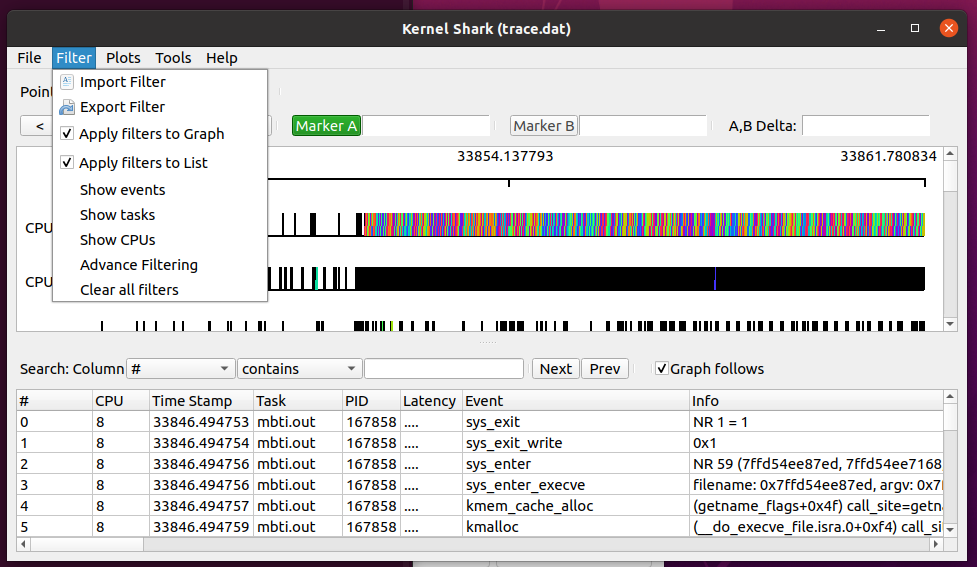
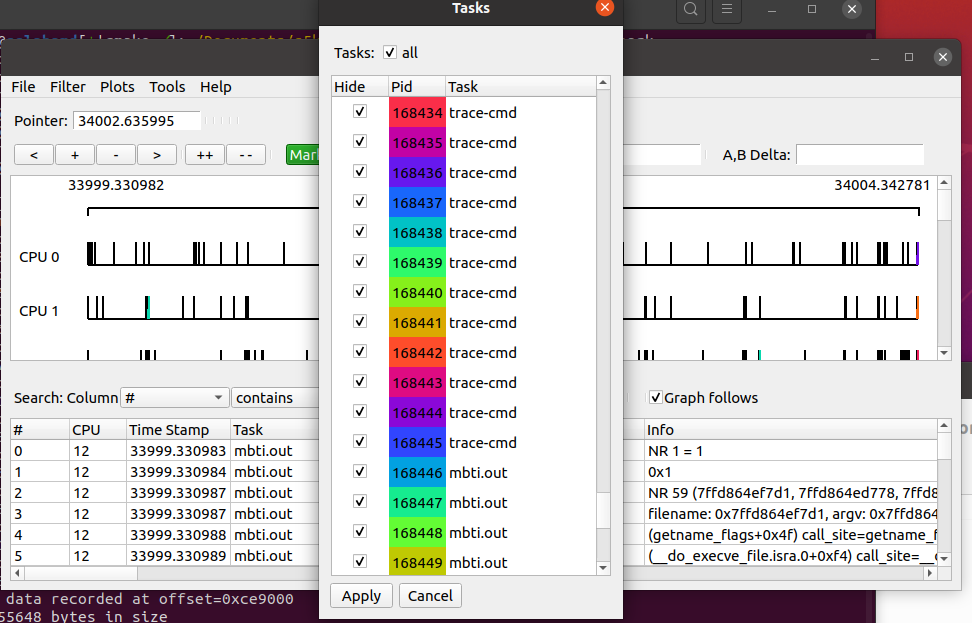
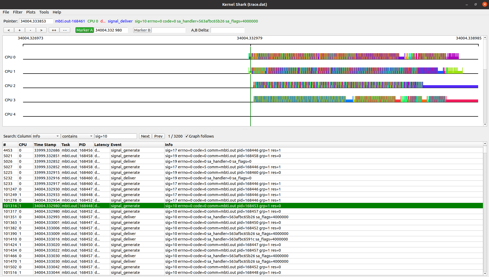

# MicroBenchmark Test Interface (MBTI)

## 0. 개발자

---

- 김상재: <hestarium@konkuk.ac.kr>
- 박성준: <parks8109@naver.com>
- 이종빈: <empty_paper@icloud.com>
- 장서연: <4066898@naver.com>

## 1. 폴더 구조

---

각 폴더 개발자들은 폴더를 생성하여 개발을 진행하도록 한다.


## 2. 소스파일 구조

---


## 3. 헤더파일 구조

---

```h
/***** Parent Header *****/
#include "../mbti.h" 

// 현재 Header 파일의 시작을 나타낸다.

/* 중요 */
// 각 측정 분야의 최상위 Header는 Parent Header(../mbti.h)와의
// 중복 선언 방지를 위하여 아래와 같은 처리를 반드시 하여야 함.

// #ifndef 와 #endif 사이에 정의되는 모든 것들은 현재 및 하위 헤더만 사용가능하며
// Parent Header에서는 사용이 불가능하다.

/* 권장 사항 */
// 전처리문자 규칙은 헤더 파일을 아래와 같은 양식으로 적는 것이다.
// 헤더파일 이름으로 적으며, 맨 앞뒤에 밑줄 두개를 추가한다.
// ex. ab_def_123.h => __AB_DEF_123_H__

// Start mbti_xx.h
#ifndef __MBT_XX_H__
#define __MBT_XX_H__

/* ------- */
/* Defines */
/* ------- */
#define MQ_FILE "/mbti_sig_mq"

/* ------- */
/* Headers */
/* ------- */
#include <signal.h>

/* ---------- */
/* Structures */
/* ---------- */
typedef struct __time_msg{
    long mtype;
    double measure_time;
}time_msg;

/* ---------------- */
/* Global Variables */
/* ---------------- */
struct timespec start_point, end_point;

// 여기에 정의되는 함수들은 반드시 헤더파일과 동일한 이름을 갖는 .c 파일에 구현한다.
// ex. sig_test는 mbti_xx.h에 선언되어 있으므로 mbti_xx.c 파일에 구현한다.
/* --------- */
/* Functions */
/* --------- */
double sig_test(int topology, int processes, int iter, int num_cpus);

/* -------- */
/* Topology */
/* -------- */
#include "mbti_sig_pp.h"

// End mbti_xx.h
#endif
```

## 4. 소스 코드 구조

---

```c
// mbti_xx.c
// mbti_xx.h에서 선언된 함수들이 작성되어있는 코드이다.
#include "mbti_xx.h"

double sig_test(int topology, int processes, int iter, int num_cpus){
    ...
}

```

## 5. 컴파일 명령

---

- 실행 파일명은 **"mbti.out"** 으로 하고 mbti_main.c를 포함한 **모든 폴더의 c파일**을 포함시켜야 한다.
- 컴파일 옵션은 현재는 **-lrt** 를 붙여야 하며 이 이후에 추가될 예정이다.

- ~~**cmake** 를 이용하여 컴파일의 용이성을 찾으려 하고 있다.~~
-> **cmake**를 활용한 컴파일 방식을 채택
  - ***cmake .*** 를 먼저 입력하여 Makefile을 생성
  - ***make*** 를 입력하여 컴파일 실행
    ```bash
    $ cmake . && make 
    ```

  - 현재 컴파일 옵션은 -lrt 해당하는 옵션만 추가되어 있고 추가적인 컴파일 옵션은 다음의 명령어를 추가하면 됨.
      - mbti/CMakeLists.txt에 맨 아래줄에 target_link_libraries라는 명령어가 있다. 이 명령어를 작성된 양식으로 적으면 된다.
      - 예를 들어 gcc 컴파일 시 -lpthread 라는 라이브러리 링크가 필요할 경우
    ```Makefile
    target_link_libraries(mbti.out pthread)
    ```
      로 적으면 된다. (lpthread중 l을 제외하고 pthread를 입력해야한다.)


## 6. Core Affinity 적용 여부 확인 방법

1. 다음 명령어를 실행한다.
- 본인의 실행파일 명령어가 ./mbti.out 1 8 100000 1 일 경우
    ``` bash
    sudo trace-cmd record -e all ./mbti.out 1 8 100000 1
    ```

2. 원격 데스크톱으로 접속한다.
  - a. 윈도우+R을 누르고 mstsc 입력
  - b. 해당 IP와 Port를 입력 후 접속
  - c. session id/pw에 본인의 id/pw 입력

3. 원격 데스크탑에서 terminal을 실행한다.
4. terminal에서 1의 sudo 명령어를 실행한 디렉터리로 이동한다.
5. ***ls*** 를 입력하여 **trace.dat**이 있는지 확인한다.
6. ***kernelshark*** 명령어를 입력한다.
7. ***kernelshark*** 사용법
    1. 초기화면 

    2. 필터설정 
    - 저기서 Show events, tasks, CPUs를 통해 필터링 할 수 있음.
    
    3. Tasks 필터링 
    - 이 중에서 우리가 필터링 해야하는건 현 프로젝트의 실행파일인 **mbti.out**이다.
    - 체크에 Hide라고 되어있는것이 아니라
    - trace-cmd를 filtering 하지 말것
    
    4. 필터링 결과 
    
    5. 결론은 이거 열심히 필터링 해서 확인하시면 됩니다.

## 7. 생성된 CSV 및 PNG 파일명 규칙
- 그래프 출력을 위해 다음 규칙이 추가되었으며 이는 script.py로 파일을 생성할 시에만 적용이 됨.
- YYYYMMDDHHXXSS_{TYPE}_{TOPOLOPY}_{GRAPHTYPE}
- YYYY: Year, MM: Month, DD: Day, HH: Hour, XX: Minute, SS: Second
- TYPE: SIG(Signal), IPC(IPC), MUT(Mutex), SEM(Semaphore)
- TOPOLOGY: PPT(Ping-Pong Test)
- GRAPHTYPE: COR(Variation about Number of Cores), PRC(Variation about number of processses)